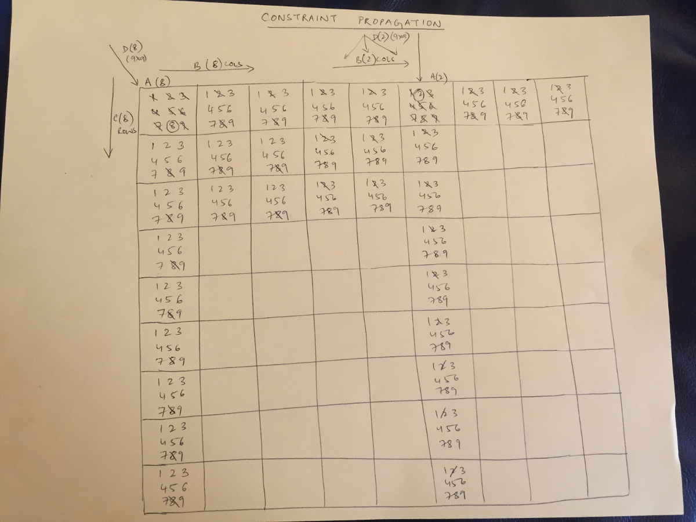
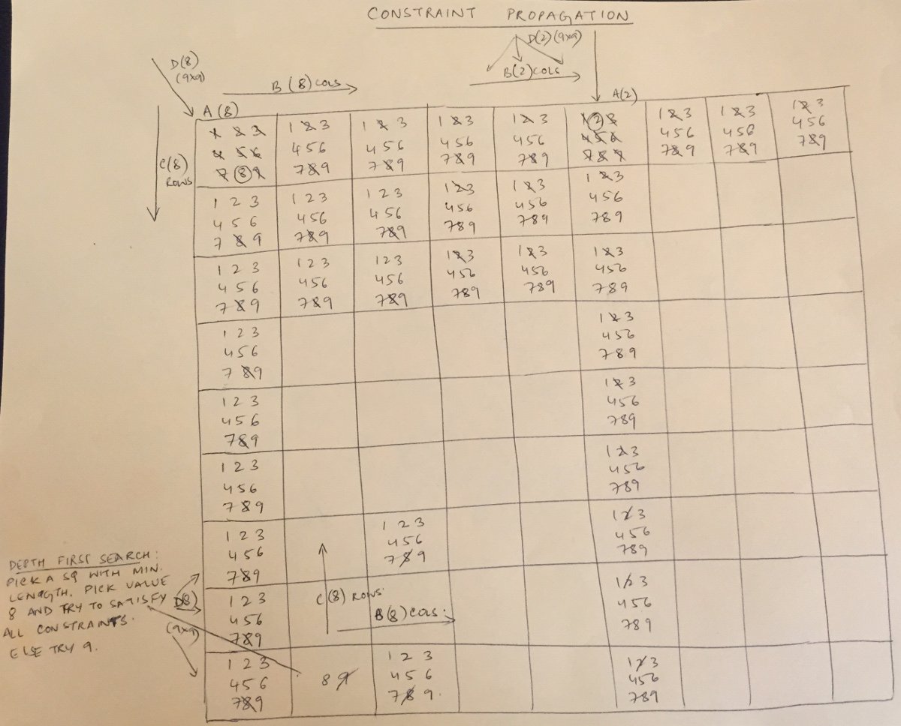

# Approach to the Sudoku puzzle

Upon reading the requirements, I started reading about Sudoku on the Internet.
The first article I read was about the BackTracking method on Wikipedia
(http://en.wikipedia.org/wiki/Sudoku_solving_algorithms). The rules of the game
were explained as follows:

The objective of Sudoku is to fill each square in a 9x9 grid with a value from 1
to 9 while observing the following constraints:

1. Each number 1 to 9 may only appear in each row .
2. Each number 1 to 9 may only appear in each column once.
3. Each number 1 to 9 may only appear in each box (a smaller 3x3 grid) once.

I decided to attempt solving the problem using the BackTracking algorithm as it
seemed like a very simple approach.

My work in the past has primarily been on SQL databases and I am not well versed
with any of the languages listed in the Sudoku coding challenge. I chose Python
because it is easy to learn and it has good data structures.

After attempting to solve the puzzle using the BackTracking algorithm, I
realized that while it was a simple approach, it was not a very efficient one.
So I decided to implement the solution using the Constraint Propagation
algorithm by Peter Norwig.
[Solving Every Sudoku Puzzle](http://norvig.com/sudoku.html).


# Algorithm

## Satisfy constraints

The constraint satisfaction algorithm iterates through each square and checks
if a value is assigned via the puzzle (input). It then applies the following
constraints to assign valid values and eliminate invalid values from the board:

1. If a square has only one possible value then remove the value from peer
   squares
2. If only one square in a unit can have a value then put the value there



## Depth first search

Satisfying all constraints may or may not have solved the Sudoku. As a next step,
a depth first search using the smallest number of possibilities is performed.
The goal is to quickly reduce the number of possible solutions. This results
in faster code execution times and lower CPU load.



The credit must go to Peter Norvig for this algorithm.
I merely reimplemented his work and stepped into the logic to ensure that I
could both understand and implement the algorithm.


# Summary

You can view the final code in [sudoku.py](sudoku.py). Use the following commands
to run to solve the example puzzles:

```bash
python sudoku.py -i puzzle/test.csv -o solution/test.csv
```


# References

- [Sudoku Wikipedia article](http://en.wikipedia.org/wiki/Sudoku_solving_algorithm)
- [Sudoku as a Constraint Problem](http://4c.ucc.ie/~hsimonis/sudoku.pdf)
- [Constraint satisfaction](http://en.wikipedia.org/wiki/Constraint_satisfaction)
- [Backtracking](http://en.wikipedia.org/wiki/Backtracking)
- [Solving Every Sudoku Puzzle](http://norvig.com/sudoku.html)
- [Google Python Style Guide](https://google-styleguide.googlecode.com/svn/trunk/pyguide.html)
